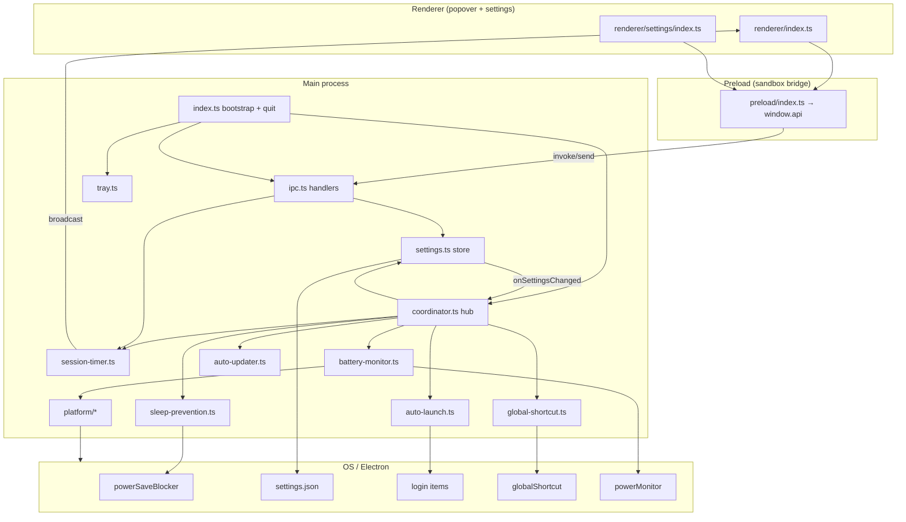
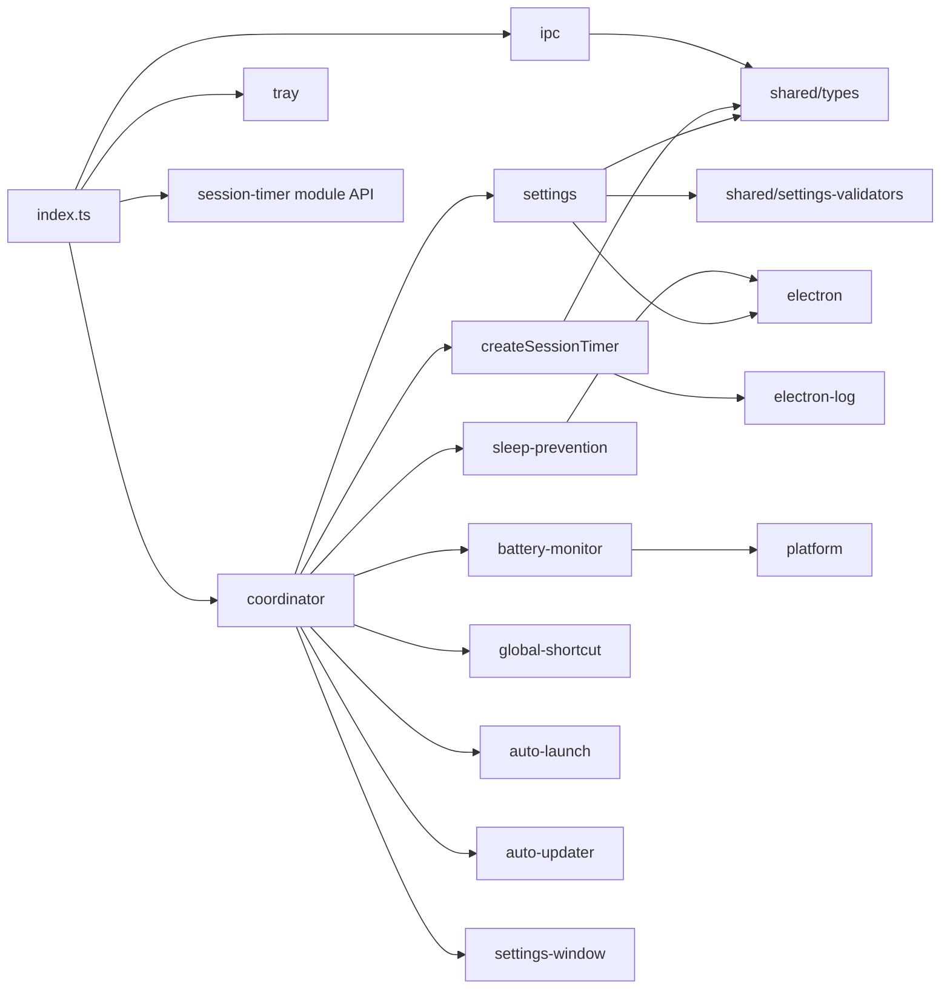
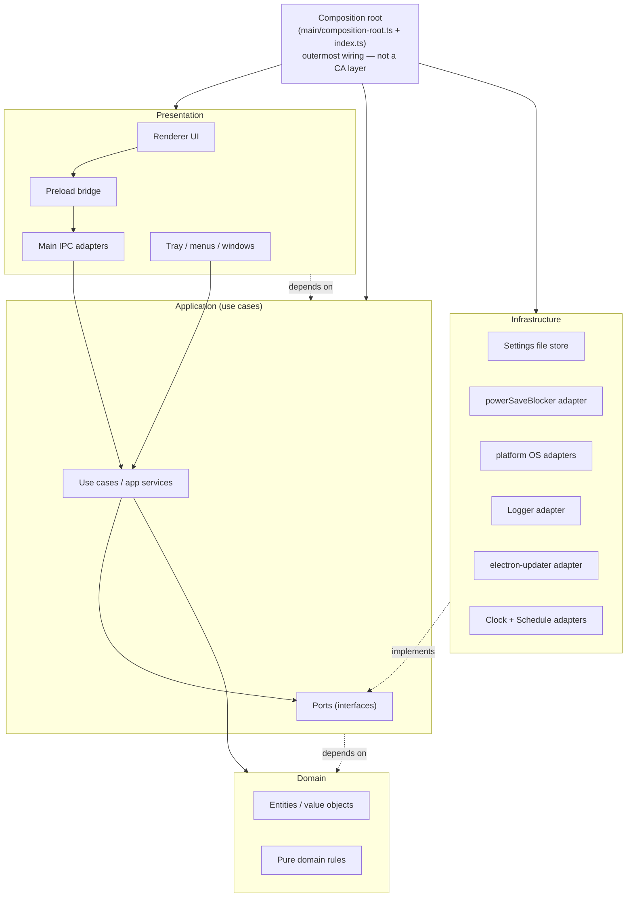
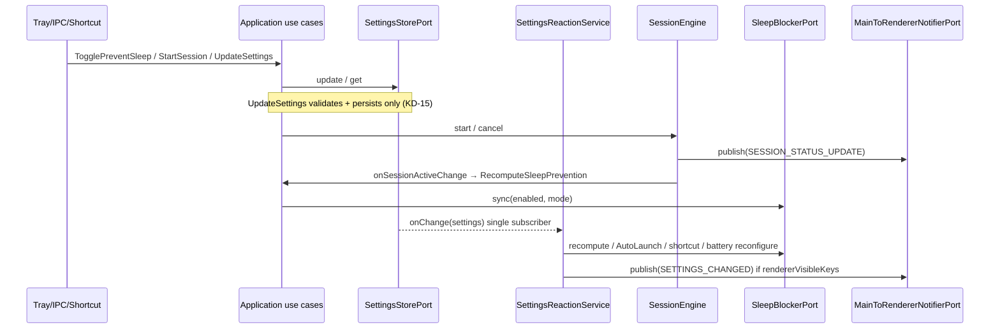
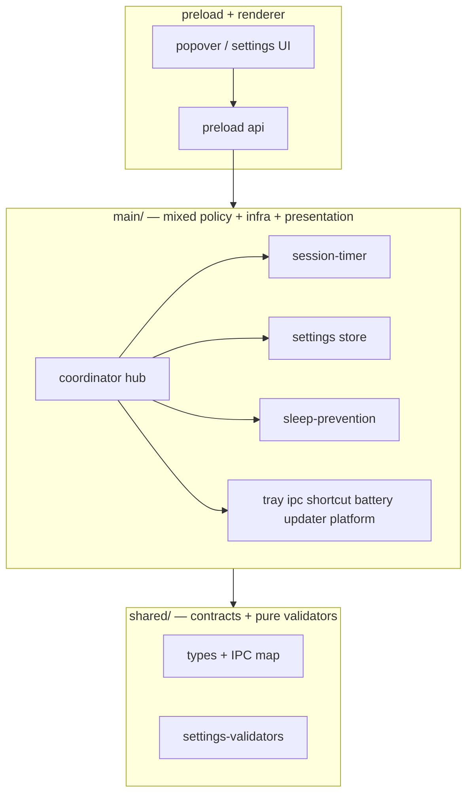
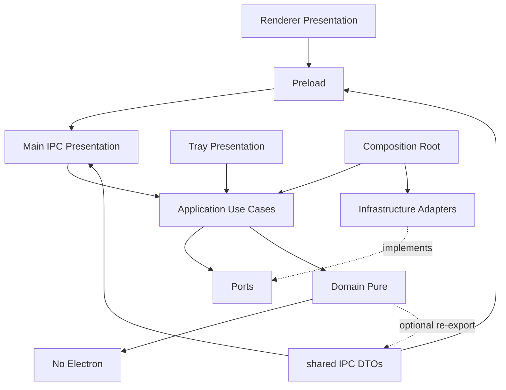
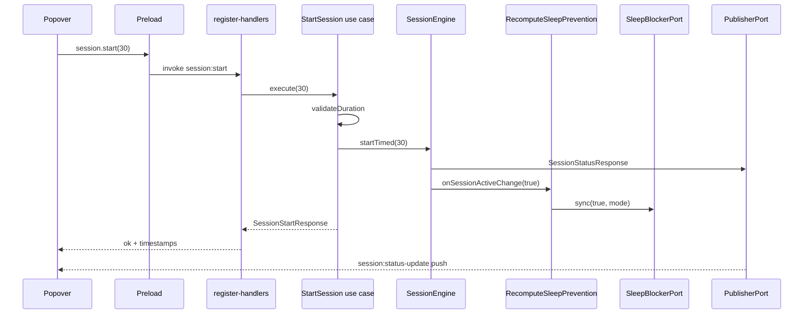

# Clean Architecture Migration for Amphetamine

| Field | Value |
| --- | --- |
| **Author** | Kenny Dizi / iworkforces Engineers |
| **Date** | 2026-07-27 |
| **Status** | Draft (rev 2.2 — user decisions final: composition, platform, benchmark, log tags) |
| **Branch** | `refactoring-codebase` |
| **Workspace** | `/Users/mac/Documents/techx/Amphetamine` |
| **Related version** | `1.9.7` (current `package.json`) |
| **Delivery model** | **One single PR**, multiple internal waves (not a multi-PR stack) |

---

## Overview

Amphetamine is a tray-only Electron app (macOS + Windows) that prevents system sleep via user intent and/or timed sessions, with battery-aware auto-disable, global shortcut, settings window, hybrid auto-updater, and a production benchmark harness. The current codebase (~36 TypeScript source files under `src/`, **~5.3k LOC production TS** under `src/` excl. d.ts, **~7.7k LOC tests** / 25 `*.test.ts`) is **process-partitioned** (`main` / `preload` / `renderer` / `shared`) with strong sticky type-safety and partial dependency injection — but **policy, state machines, and infrastructure are still co-located** inside main-process modules, with `coordinator.ts` as a central hub and several module-level singletons.

This document analyzes the live architecture (concrete files, types, and dependency directions), defines a **pragmatic Clean Architecture** adapted to Electron’s multi-process model, proposes a target folder structure and module boundaries, and provides a **single-PR, multi-wave migration plan** that keeps intermediate commits shippable and testable without a big-bang rewrite.

The guiding principle: **extract pure domain and application use cases so they are unit-testable without Electron**, push OS/Electron I/O into adapters, and thin the composition root — **without drowning a ~tray-app codebase in enterprise ceremony** (no generic repository base classes, no DDD aggregate roots for every boolean setting, no nested “enterprise” packages for one entity).

---

## Background & Motivation

### Current architecture (verified in tree)

```text
src/
  main/                 Electron main: lifecycle, tray, IPC, policy hub
    index.ts            bootstrap + single quit orchestrator
    coordinator.ts      settings → system sync hub (god-orchestrator)
    session-timer.ts    session state machine + timer + module-level delegators
    sleep-prevention.ts sole powerSaveBlocker owner
    settings.ts         JSON persistence + EventEmitter + write mutex
    battery-monitor.ts  threshold detector (DI factory)
    ipc.ts / ipc-utils  typed handlers + sender allowlist
    tray.ts             Tray UI adapter (DI via TrayDeps)
    platform/           OS adapters (os, shell, window-chrome, battery-percent)
    auto-updater*.ts    hybrid updater
    global-shortcut.ts  accelerator registration
    auto-launch.ts      login items
    settings-window.ts / about-window.ts / security.ts / benchmark*.ts
  preload/              contextBridge API (typed invoke)
  renderer/             vanilla TS popover + settings entry
  shared/               IPC contracts, AppSettings, validators, benchmark types
```

**Scale snapshot (approx.):**

| Area | Size |
| --- | --- |
| Source TS files (`src/`, excl. d.ts) | ~36 |
| Production TS LOC under `src/` | **~5,338** (not ~9k; earlier `wc` double-counted) |
| Main largest modules | `auto-updater.ts` ~395, `session-timer.ts` ~335, `coordinator.ts` ~277, `tray.ts` ~225 |
| Renderer largest | `settings/index.ts` ~503, `index.ts` ~457 |
| Shared contracts | `types.ts` ~230, `settings-validators.ts` ~247 |
| Tests | 25 `*.test.ts` files, ~7,660 LOC |
| Coverage gates | lines 80 / functions 80 / branches 70 |

### What already works well

These patterns are **assets** of the migration, not collateral damage:

1. **Type-safe IPC** — `IPC_CHANNELS` + `IpcChannelMap` + `typedHandle()` + preload `invoke<K>()` + exhaustive `WiredChannels` (shared contract surface is excellent).
2. **Partial DI factories** — `SessionTimerDeps`, `BatteryDeps`, `ShortcutDeps`, `TrayDeps`, `IpcDeps` already isolate some side effects at construction time.
3. **Platform adapters** — `src/main/platform/` with `isDarwin` / `isWin32`, public barrel `platform/index.ts`.
4. **Policy ownership rules** — battery detects only; coordinator owns auto-stop; sleep-prevention is the sole `powerSaveBlocker` owner; session timer does not write settings.
5. **Pure-ish validation** — `settings-validators.ts` (`VALIDATORS`, `mergeValidatedPartial`, accelerator rules) has no Electron imports.
6. **Sticky strict + sticky ESLint** — non-negotiable and must survive the refactor.

### Pain points (concrete)

| Pain | Evidence | Expandability cost |
| --- | --- | --- |
| **Coordinator hub** | `coordinator.ts` imports settings, auto-launch, shortcut, sleep-prevention, battery-monitor, session-timer, auto-updater, tray types, settings-window, about-window | Every new settings field or policy adds a branch here; hard to unit-test policy in isolation |
| **Module-level singletons** | `settingsCache`, `blockerId`, `activeHandle` + `setActiveSessionTimer`, tray/menu caches, updater broadcast fn injection | Hidden global state; tests need `vi.resetModules()`; composition is opaque |
| **Domain mixed with infrastructure** | `session-timer.ts` imports `electron-log`, optional `powerMonitor`, `IPC_CHANNELS`, and `broadcast` | Cannot unit-test pure session transitions without Electron mocks |
| **Settings I/O + domain shape co-owned** | `settings.ts` owns load/save + EventEmitter + failure dialog; shape/defaults live in `shared/types.ts` | Hard to add alternate stores (e.g. future cloud prefs) without rewriting policy |
| **IPC as application API** | Handlers in `ipc.ts` encode validation + call into modules; use cases are not named | New clients (CLI, tests, future protocol) must reimplement the same rules |
| **Process layout ≠ dependency rule** | `src/main/*` is both composition root *and* all business logic | No compile-time enforcement that domain stays pure |
| **Renderer embeds policy** | `isEffectivelyActive()` in `renderer/index.ts` duplicates coordinator formula | Drift risk if effective-active rule changes |
| **Shared conflates transport + domain** | `types.ts` holds IPC map *and* `AppSettings` *and* session DTOs | Fine for Electron apps if intentional; becomes muddy when “domain” should not care about channel names |

### Why Clean Architecture *here* (and why carefully)

**Why:** expandability (new policies, future surfaces, clearer tests) and maintainability (dependency direction, smaller modules, explicit use cases). The codebase already *half-invented* Clean Architecture via ports (`*Deps`) and pure validators — the gap is incomplete extraction and a composition hub that still knows everything.

**Why carefully:** Amphetamine is a **small tray utility**, not a multi-team enterprise backend. Over-layering (entities per setting key, mediator bus, CQRS, generic unit-of-work) would *hurt* maintainability. The design below is intentionally **“Clean Architecture Lite”**: thin domain, focused use cases, real ports only where seams already exist or pay for themselves.

### Reconciliation with CODING_GUIDELINES.md

Repo guidelines bias to **simplicity first**, **surgical changes**, and “don’t refactor things that aren’t broken.” This PR is an **intentional, bounded exception**:

1. The coordinator hub + module-level session globals **are** structural defects that block pure unit tests and safe expansion (documented pain points above).
2. Scope is capped by **success metrics** and a **file/ceremony budget** (below) — not an open-ended rewrite.
3. Product behavior, IPC, and packaging are frozen; waves are shippable; optional polish **Wave 6b shared/ipc file split only** may be **cancelled without failing merge** if pure-test metrics are already met **and Wave 6a is complete** (see KD-16). **`platform/` stays under `main/platform` for this PR (no physical move). Benchmark modules move to `infrastructure/benchmark` (required, Wave 6b).**
4. Prefer move/extract (KD-13) over speculative new abstractions; collapse one-call-site use cases into co-located modules.

### Success metrics (PR is “done enough” when)

| Metric | Pass criterion |
| --- | --- |
| **M1 Pure session** | Timed/indefinite start, cancel, expiry, resume-reconcile unit-tested **with zero Electron mock** (fake `ClockPort` + `SchedulePort` only) |
| **M2 Pure policy** | Effective-active OR matrix + low-battery auto-stop policy unit-tested with mock ports only |
| **M3 No god hub** | No single module owns settings-diff reactions **and** session lifecycle **and** tray deps **and** updater wiring; composition root wires only |
| **M4 No session globals** | Zero `setActiveSessionTimer` / module-level session delegators in production |
| **M5 Layer purity** | `src/domain` + `src/application` import neither `electron` nor `electron-log` (CI check) |
| **M6 Product freeze** | IPC wire + settings schema + Appendix A matrix unchanged |

### Scope budget (anti-ceremony)

| Budget | Limit |
| --- | --- |
| New top-level trees under `src/` | At most `domain/`, `application/`, `infrastructure/` (plus existing process roots) |
| Port interfaces | Prefer ≤12 ports (list in Ports section is the budget); do not add ports for Tray/Menu/BrowserWindow chrome |
| Use-case files | Collapse related ops into one module when a “use case” has &lt;3 call sites (e.g. `application/session/index.ts` exporting start/cancel/getStatus rather than three micro-files) |
| Required Wave 6a (not cancellable) | Renderer imports domain `isEffectivelyActive`; remove obsolete re-export shims that leave a dual-structure production tree |
| Wave 6b **required** | Move `main/benchmark*` → `infrastructure/benchmark/` (re-export shims under old paths until imports updated) |
| Optional polish **6b only** (KD-16 cancellable) | Full `shared/ipc/*` file split — **not required** for merge if M1–M6 pass and 6a + benchmark move done. **`platform/` physical move is out of scope (always leave under `main/platform`)** |
| Effort ceiling | Target **≤10 eng-days** for mergeable core (Waves 0–5 + **6a** + 6b-required benchmark + minimal docs). Optional shared/ipc split + Wave 7 log-tag renames if time remains |

---

## Goals & Non-Goals

### Goals

1. **Dependency rule:** Domain and Application must not import Electron, Node `fs`, or process-specific UI. Infrastructure and Presentation depend inward.
2. **Named use cases** for primary product flows: toggle prevent-sleep, start/cancel session, update settings (partial), low-battery auto-stop, recompute effective sleep prevention, register shortcut, check for updates (user-initiated).
3. **Test pure logic without Electron mocks** for session state machine, effective-active policy, settings merge/validation (already pure), battery threshold gating logic — measured by success metrics M1–M2.
4. **Preserve product contracts:** IPC channel names/payloads, settings schema, sticky TS/ESLint, platform adapters, anti-patterns from `AGENTS.md` (sole `powerSaveBlocker` owner, `validateSender`, no `Date.now()` for elapsed timing except wall-clock expiry anchor).
5. **Single PR, multi-wave commits** — each wave leaves `typecheck`, `typecheck:sticky`, `lint`, `test` green and the app manually smokeable.
6. **Keep intermediate architecture shippable** — no wave leaves the app non-bootable; adapters can temporarily dual-path during migration.

### Non-Goals

1. **Multi-PR stack** — waves replace PRs as the incremental unit (user mandate).
2. **UI framework migration** (React/Vue/Svelte) or visual redesign.
3. **Linux support**, Store/MSIX, new product features.
4. **Changing IPC wire protocol** unless a wave *requires* a non-breaking additive channel (prefer zero wire changes).
5. **Full DDD ceremony** — aggregates, domain events bus, event sourcing, generic repositories.
6. **Rewriting auto-updater business** beyond boundary extraction.
7. **Removing process boundaries** (main/preload/renderer stay — Electron requires them).
8. **Micro-package monorepo** (`packages/*` with publishable libs) — in-repo folders only unless later justified.
9. **Downgrading sticky type-safety** or relaxing production ESLint for convenience.
10. **Mandatory completion of optional Wave 6b `shared/ipc/*` split** when M1–M6 already pass and 6a + benchmark move are done — that polish alone may be cancelled. **Wave 6a is not optional. Benchmark → `infrastructure/benchmark` is required. Platform physical move is out of scope.**

---

## Current Architecture Analysis

### Runtime processes and data flow



### Dependency direction (current)



**Direction summary:** Dependencies mostly fan *inward* to `shared/` and *outward* to Electron, but **Application policy does not exist as a layer** — it lives inside `coordinator.ts` and handlers. Domain-ish rules live in `session-timer` and `settings-validators` but are not free of infrastructure.

### Module coupling map (main)

| Module | Role | Couples to | Smell |
| --- | --- | --- | --- |
| `coordinator.ts` | Policy + wiring + lifecycle of monitors | Nearly all feature modules | **God orchestrator** |
| `session-timer.ts` | State machine + scheduling + push | shared IPC types, log, powerMonitor | Mixed domain/infra; **module-level `activeHandle`** |
| `settings.ts` | Persistence + notify | Electron app/dialog, fs, validators | Infra + app service |
| `sleep-prevention.ts` | Blocker lifecycle | Electron powerSaveBlocker | Clean adapter (already) |
| `battery-monitor.ts` | Detector | powerMonitor, platform battery | Good DI; policy externalized |
| `ipc.ts` | Transport | IpcDeps, validation, session | Thin but holds duration validation that belongs in use case |
| `index.ts` | Composition + window + quit | Everything for bootstrap | Acceptable composition root; slightly fat |
| `tray.ts` | Presentation (main) | Electron Tray/Menu, about-window | Adapter with DI — good |
| `global-shortcut.ts` | Adapter | Electron, broadcast | Good DI |
| `auto-updater.ts` | Infra + some UX policy | electron-updater, dialog, shell | Large; hybrid policy embedded |
| `platform/*` | OS ports | process, child_process, Electron chrome | Already adapter-shaped |

### Layer violations (today)

1. **Session domain → IPC transport:** `SessionTimerDeps.broadcast` is typed on `PushChannel` / `IpcResponse` (`session-timer.ts`), so domain timing knows push-channel vocabulary.
2. **Session domain → logging framework:** direct `electron-log` import.
3. **Settings application → UI dialogs:** consecutive save failures open `dialog.showErrorBox` inside `settings.ts`.
4. **Effective-active policy duplicated:** coordinator (`userIntent || sessionActive`) and renderer (`settings.preventSleep || sessionStatus?.isRunning`).
5. **Duration validation in IPC adapter:** `SESSION_START` max 1440 / integer checks in `ipc.ts` rather than a pure use-case validator.
6. **Module-level session delegators:** `setActiveSessionTimer` + `startSession` exports exist so `index.ts` can pass namespace import into `IpcDeps` — a legacy composition shortcut that Clean Architecture should eliminate via explicit handle injection only.

### God-object assessment: `coordinator.ts`

Responsibilities currently owned by the coordinator:

1. Settings init + subscription + field-level diffing  
2. Sleep recompute policy (`preventSleep || sessionActive`)  
3. Sleep block mode restart  
4. Auto-launch sync  
5. Battery monitor construction + low-battery **policy** (`preventSleep: false` + cancel session)  
6. Session timer construction + `setActiveSessionTimer`  
7. Shortcut deps wiring + re-register on change  
8. Updater broadcast fn injection  
9. Tray deps factory (`getTrayDeps`)  
10. Effective-active listener fan-out for tray icon  
11. Cleanup of windows + monitors + timers + updater  

This is **legitimate application orchestration**, but it is **not structured as use cases + ports**. Migration should **split policy into named use cases** and leave a thin **composition root** (composition of adapters + subscription wiring), not delete orchestration entirely.

### Existing seams to reuse (do not reinvent)

| Existing seam | Clean Architecture mapping |
| --- | --- |
| `SessionTimerDeps` / `createSessionTimer` | Application session engine + `ClockPort` + `SchedulePort` + notifier |
| `BatteryDeps` / `createBatteryMonitor` | Infrastructure detector implementing a port; `onAutoStop` → use case |
| `IpcDeps` | Presentation adapter deps (inject use cases) |
| `TrayDeps` / `ShortcutDeps` | Presentation/infra ports |
| `VALIDATORS` / `mergeValidatedPartial` | Domain or application pure functions (already) |
| `platform/*` | Infrastructure adapters |
| `sleep-prevention.ts` | Infrastructure adapter for `SleepBlockerPort` |
| `broadcastToWindows` | Infrastructure implementation of **`MainToRendererNotifierPort`** (all PUSH_CHANNELS; not a separate session-only publisher) |
| `shared/types.ts` IPC map | Presentation/shared transport contracts (keep) |

---

## Clean Architecture for this Electron App

### Layer definitions (adapted)

Electron forces **three runtimes**. Clean Architecture layers are **logical**, not “one Node server.” Presentation spans all three processes.



**Composition is outermost wiring** (lives under `src/main/`), not Presentation. It may import Application factories, Infrastructure adapters, and Presentation registrars (`registerIpcHandlers`, `setupTray`). Application must not import the composition root.

**Dependency rule (enforced by convention + eslint import boundaries in a later wave):**

- **Domain** → nothing inward; no Electron, no Node I/O, no IPC channel constants.
- **Application** → Domain + port interfaces only (no Electron).
- **Infrastructure** → Domain types + Application ports (implements them); may use Electron/Node.
- **Presentation** → Application use cases (main) or transport DTOs (preload/renderer); renderer never imports Infrastructure.

### Electron multi-process mapping

| Process | Allowed layers | Forbidden |
| --- | --- | --- |
| **Main** | Composition, Presentation adapters, Application, Domain, Infrastructure | Renderer DOM |
| **Preload** | Presentation bridge only; may import **shared transport contracts** | Domain use cases, Node fs, main modules |
| **Renderer** | Presentation UI; shared DTO types | Electron, main, infrastructure, application (unless pure shared domain helpers deliberately exposed) |

**Important decision:** Pure domain helpers that both main and renderer need (e.g. `isEffectivelyActive(intent, sessionRunning)`) may live in `src/domain/` and be imported by renderer **only if** domain stays free of Node/Electron. That is preferred over duplicating the formula.

### Ports (interfaces) — proposed (budget ≤12)

Keep ports **few and real**. This list is the **closed budget** for Wave 1–4; do not add ports for Tray/Menu/BrowserWindow chrome, CSP, or About HTML (those stay concrete presentation/infra helpers).

```ts
// application/ports/*.ts (illustrative — names fixed in Wave 1)

/** Persist and observe settings snapshots. */
export interface SettingsStorePort {
  init(): Promise<void>;
  get(): AppSettings; // cloned snapshot
  update(partial: Partial<AppSettings>): Promise<{
    settings: AppSettings;
    rejectedKeys: string[];
  }>;
  onChange(cb: (settings: AppSettings) => void): () => void;
  flush(): Promise<void>;
}

/**
 * User-visible alert when disk save fails repeatedly.
 * Construction-time callback on the file store adapter (not domain).
 * Live code: dialog.showErrorBox after MAX_CONSECUTIVE_SAVE_FAILURES.
 */
export interface SettingsSaveFailurePort {
  notifyPersistenceBroken(): void;
}

/** OS sleep blocker. Sole implementer wraps powerSaveBlocker. */
export interface SleepBlockerPort {
  sync(enabled: boolean, mode: SleepBlockMode): void;
  isActive(): boolean;
  stop(): void;
}

/**
 * Typed main→renderer push. Single port for all PUSH_CHANNELS payloads
 * (session status, settings changed, shortcut registration failed,
 * auto-updater status, window hide). Prefer this over per-channel ports.
 * Infrastructure adapter wraps broadcastToWindows.
 */
export interface MainToRendererNotifierPort {
  publish<K extends PushChannel>(channel: K, data: IpcResponse<K>): void;
}

/** Monotonic + wall clock (testable). Date.now only at wallNow boundary. */
export interface ClockPort {
  perfNow(): PerfTimestamp;
  wallNow(): number;
}

/**
 * Cancellable delayed work. Required so session engine never imports setTimeout.
 * Node adapter: setTimeout + handle.unref(); cancel → clearTimeout.
 * Tests: fake schedule that records callbacks and advances manually (no real timers).
 */
export interface SchedulePort {
  schedule(ms: number, cb: () => void): { cancel(): void };
}

/** Login item sync. */
export interface AutoLaunchPort {
  sync(launchAtLogin: boolean): void;
}

/**
 * Global shortcut registration.
 * Failure publishing to renderers is NOT part of this port’s return path alone:
 * the infrastructure adapter (or RegisterAppShortcut use case) must call
 * MainToRendererNotifierPort.publish(SHORTCUT_REGISTRATION_FAILED, { accelerator })
 * on register failure — preserving live global-shortcut.ts behavior.
 */
export interface GlobalShortcutPort {
  register(accelerator: string, onToggle: () => void): { ok: true } | { ok: false; accelerator: string };
  unregisterAll(): void;
}

/** Battery percent + AC/battery events. */
export interface BatterySensorPort {
  getPercent(): Promise<number | null>;
  onPowerSourceChange(handlers: {
    onBattery: () => void;
    onAc: () => void;
    onResume: () => void;
  }): () => void;
}

/** Logger — thin wrapper so domain/application never import electron-log. */
export interface LoggerPort {
  info(message: string, ...args: unknown[]): void;
  warn(message: string, ...args: unknown[]): void;
  error(message: string, ...args: unknown[]): void;
}

/**
 * Hybrid auto-updater façade (KD-17). Hybrid download/install policy stays
 * inside infrastructure; application only needs lifecycle + user-initiated check.
 * Replaces injectable setBroadcastFn module state: adapter receives
 * MainToRendererNotifierPort at construction.
 */
export interface UpdaterPort {
  init(): void;
  stop(): void;
  checkNow(): void; // tray / IPC "Check for Updates"
}
```

**Port count:** 11 interfaces above (within ≤12 budget). `SessionStatusPublisherPort` is **not** a separate type — session engine depends on `MainToRendererNotifierPort` (or a narrow façade function `publishSessionStatus` bound at composition) so we do not proliferate push ports.

**Explicit non-ports:** BrowserWindow chrome, CSP, about HTML, Tray/Menu construction, `validateSender` (infra helper used by presentation IPC, not a use-case port).

### Use cases (application services)

| Use case | Trigger | Side effects (via ports) |
| --- | --- | --- |
| `RecomputeSleepPrevention` | settings change, session active change, mode change | `SleepBlockerPort.sync` |
| `TogglePreventSleep` | tray, shortcut, popover | `SettingsStorePort.update` → recompute |
| `StartSession` | IPC / future callers | session engine + recompute + publish |
| `CancelSession` | IPC, low battery | session engine + recompute + publish |
| `UpdateSettings` | IPC settings:set | **persist only** via `SettingsStorePort` (no field reactions — KD-15) |
| `SettingsReactionService` | single `onChange` subscription at composition init | field reactions only (see table below) |
| `HandleLowBatteryAutoStop` | battery detector | `preventSleep: false` + cancel session |
| `RegisterAppShortcut` | init + shortcut setting change | `GlobalShortcutPort` |
| `CheckForUpdatesNow` | tray / IPC | existing updater adapter (facade) |

Prefer **functions or small classes with constructor-injected ports** matching existing factory style (`createSessionTimer(deps)`), not a heavy DI container.

### Domain model (minimal)

| Concept | Kind | Notes |
| --- | --- | --- |
| `AppSettings` | Value object / DTO | **Domain owns** type + `DEFAULT_SETTINGS` (KD-8 / closed OQ-1); `shared` re-exports for preload/renderer |
| `SleepBlockMode` | Enum-like union | Already pure |
| `Session` state | Discriminated union | Extract from `InternalSessionState` in session-timer |
| `EffectiveSleepPrevention` | Pure function | `userIntent \|\| sessionActive` |
| `SessionDuration` rules | Pure validation | integer, >0, ≤1440, or null indefinite |
| `BatteryThreshold` | Pure | 0 = disabled; (0,100] enabled |
| `PerfTimestamp` / `asPerf` | Brand | Keep; domain-owned |

**No** rich aggregates for settings keys. Prefer pure functions.

---

## Proposed Design

### Target folder structure

Hybrid: **process roots retained for Electron tooling**, Clean Architecture layers live primarily under main + a new pure tree importable by main (and selectively by renderer).

```text
src/
  domain/                              # PURE — no Electron, no Node I/O
    index.ts                           # public barrel (optional, shallow)
    settings/
      app-settings.ts                  # AppSettings type, DEFAULT_SETTINGS (moved or re-exported)
      sleep-block-mode.ts
    session/
      session-state.ts                 # idle | timed | indefinite
      session-status.ts                # map to SessionStatusResponse shape
      duration.ts                      # validateDurationMinutes
      effective-active.ts              # isEffectivelyActive(intent, sessionActive)
    battery/
      threshold.ts                     # isThresholdEnabled
    time/
      perf-timestamp.ts                # PerfTimestamp, asPerf
    settings-validation/               # move pure validators from shared/
      validators.ts
      merge.ts
      accelerator.ts

  application/                         # use cases + ports — no Electron
    ports/
      settings-store.port.ts
      settings-save-failure.port.ts
      sleep-blocker.port.ts
      main-to-renderer-notifier.port.ts
      clock.port.ts
      schedule.port.ts
      auto-launch.port.ts
      global-shortcut.port.ts
      battery-sensor.port.ts
      logger.port.ts
      updater.port.ts
    session/
      # Prefer one module exporting start/cancel/getStatus if call sites few
      session-use-cases.ts
      session-engine.ts                # pure transitions + ClockPort + SchedulePort orchestration
    sleep/
      recompute-sleep-prevention.ts
      toggle-prevent-sleep.ts
    settings/
      update-settings.ts               # KD-15: validate + persist only (no field reactions)
      get-settings.ts
      settings-reaction-service.ts     # KD-15 sole onChange reaction owner
    battery/
      handle-low-battery-auto-stop.ts
    shortcut/
      register-app-shortcut.ts
    composition/
      app-services.ts                  # factory wiring types (still Electron-free)

  infrastructure/                      # Electron / Node adapters
    settings/
      file-settings-store.ts           # today’s settings.ts body
    sleep/
      power-save-blocker.ts            # today’s sleep-prevention.ts
    session/
      electron-clock.ts
      main-to-renderer-notifier.ts     # implements MainToRendererNotifierPort via broadcastToWindows
    battery/
      electron-battery-monitor.ts      # today’s battery-monitor, depends on BatterySensorPort
      platform-battery-sensor.ts
    shortcut/
      electron-global-shortcut.ts
    auto-launch/
      electron-auto-launch.ts
    updater/
      electron-auto-updater.ts
      auto-updater-utils.ts
    logging/
      electron-log-adapter.ts
    benchmark/                         # production benchmark mode (moved from main/)
      benchmark.ts
      benchmark-env.ts
      benchmark-metrics.ts
    ipc/
      validate-sender.ts
      typed-handle.ts
      broadcast.ts
    package-info.ts

  main/                                # Presentation + composition for main process
    index.ts                           # composition root + quit orchestrator
    composition-root.ts                # builds ports, use cases, starts subscriptions (production-only; no test overrides)
    ipc/
      register-handlers.ts             # thin: validate sender → call use case
    tray/
      setup-tray.ts
    windows/
      popover-window.ts
      settings-window.ts
      about-window.ts
    security.ts
    constants.ts                       # UI strings, sizes (presentation constants)
    platform/                          # STAYS here this PR (logical infra; no physical move)
      index.ts
      os.ts
      shell.ts
      window-chrome.ts
      battery-percent.ts
    # Temporary re-exports only during Wave 6b if needed:
    # benchmark.ts → re-export from infrastructure/benchmark until imports updated

  preload/
    index.ts                           # unchanged contract surface if possible

  renderer/
    index.ts                           # UI; import domain effective-active helper only
    settings/
    ...

  shared/                              # Cross-process TRANSPORT contracts only
    ipc/
      channels.ts                      # IPC_CHANNELS, PUSH_CHANNELS, IpcChannelMap
      session-dto.ts                   # SessionStatusResponse, SessionStartResponse (wire DTOs)
      updater-dto.ts                   # AutoUpdaterStatus, UpdateMeta
    benchmark-types.ts
    # Re-exports of domain settings types for renderer convenience OR renderer imports domain
```

**Build note:** Rslib main entry remains `src/main/index.ts`. Domain/application/infrastructure are pulled in as imports from main (and domain optionally from renderer). Update `src/main/tsconfig.json` `include` / rootDir carefully (`rootDir: ".."` already includes shared; expand to `domain` / `application` / `infrastructure`).

### Mapping: current modules → target

| Current file | Target | Notes |
| --- | --- | --- |
| `shared/types.ts` (settings, session unions, PerfTimestamp) | Split: domain entities + `shared/ipc/*` DTOs | Prefer wire DTO = domain shape where identical to avoid mapping layers |
| `shared/settings-validators.ts` | `domain/settings-validation/*` | Already pure |
| `shared/types.ts` IPC map | `shared/ipc/channels.ts` | Transport only |
| `main/session-timer.ts` | `application/session/session-engine.ts` + infra `ClockPort`/`SchedulePort` + `MainToRendererNotifierPort` | Remove module-level delegators |
| `main/sleep-prevention.ts` | `infrastructure/sleep/power-save-blocker.ts` implements port | Keep sole ownership rule |
| `main/settings.ts` | `infrastructure/settings/file-settings-store.ts` | Dialog on failure → port or presentation callback |
| `main/battery-monitor.ts` | `infrastructure/battery/electron-battery-monitor.ts` | Detector only |
| `main/coordinator.ts` | Split into use cases + `main/composition-root.ts` | No god file; thin wiring remains |
| `main/ipc.ts` | `main/ipc/register-handlers.ts` | Calls use cases |
| `main/ipc-utils.ts` | `infrastructure/ipc/*` | Sender validation is infra |
| `main/tray.ts` | `main/tray/setup-tray.ts` | Presentation |
| `main/global-shortcut.ts` | `infrastructure/shortcut/*` | |
| `main/auto-launch.ts` | `infrastructure/auto-launch/*` | |
| `main/auto-updater.ts` | `infrastructure/updater/*` + thin use case facade | |
| `main/platform/*` | **`main/platform/*` (unchanged path)** | Logical infrastructure ownership only; **no physical move this PR** |
| `main/index.ts` | stays composition entry | Slimmer after composition-root extraction |
| `preload/index.ts` | stays | Contract stability |
| `renderer/*` | stays; import `isEffectivelyActive` from domain | No full application layer in renderer |

### Coordinator decomposition



**Composition-root responsibilities (remain, but thin):**

- Construct adapter instances implementing ports  
- Construct use-case closures/services  
- **Once:** subscribe `SettingsStorePort.onChange` → **`SettingsReactionService` only** (KD-15) — never also react inside `UpdateSettings`  
- Subscribe session active changes → `RecomputeSleepPrevention`  
- Construct battery monitor with `onAutoStop → HandleLowBatteryAutoStop`  
- Expose `getTrayDeps()`-equivalent from use cases  
- Implement `AppComposition.cleanup()` ordered checklist (below)  
- **Do not** own quit orchestration flush/tray/window destroy — that stays in `index.ts`

#### `AppComposition` init / cleanup contracts

**Init order (Wave 5 end-state — replaces today’s IPC-before-coordinator + module session delegators):**

1. `await settingsStore.init()`  
2. Construct ports (sleep blocker, schedule, clock, notifier, shortcut, launch, battery sensor, updater, logger)  
3. Construct session engine + use cases + `SettingsReactionService`  
4. Subscribe settings `onChange` → reaction service (single subscriber)  
5. Arm battery monitor; register shortcut; `updater.init()` (skip in benchmark mode as today)  
6. **Then** `registerIpcHandlers(mainWindow, composition.getIpcDeps())` — handlers receive **injected** use cases/engine; IPC before composition ready is a hard error in tests  
7. `setupTray(composition.getTrayDeps())`  
8. Benchmark entry as today  

Live today: `index.ts` builds `IpcDeps` with `sessionTimer` namespace **before** `initCoordinator()`, relying on `setActiveSessionTimer` later. Wave 5 **must reverse** that: composition first, then IPC with real handles. Tests must prove invoking session IPC before composition throws/fails closed (no silent default timer).

**`composition.cleanup()` ordered checklist** (mirrors live `cleanupCoordinator`; call from quit orchestrator **after** tray destroy):

1. `closeSettingsWindow()`  
2. `closeAboutWindow()`  
3. Unsubscribe settings reaction service (`onChange` disposer)  
4. `batteryMonitor.cleanupBatteryMonitoring()`; null handle  
5. `sessionEngine.cleanup()` (must `SchedulePort` cancel outstanding expiry handle)  
6. Clear any composition-held session/active caches and effective-active listeners  
7. `SleepBlockerPort.stop()`  
8. `GlobalShortcutPort.unregisterAll()`  
9. `UpdaterPort.stop()`  

**Quit orchestrator stays in `index.ts`** (not inside composition) — live `runQuitCleanup` shape:

1. Idempotent `didRunQuitCleanup` guard  
2. `isQuitting = true`  
3. `Promise.race(settingsStore.flush(), 2000ms timeout)` — **flush remains outside composition** (same as today: `flushSettingsWriteChain` not registered as a second `before-quit`)  
4. `cleanupTray?.()` / tray `destroy`  
5. `await composition.cleanup()` (or sync if cleanup is sync)  
6. Destroy main popover window if present  
7. `app.exit(0)`  

`stopPreventingSleep` is **inside** `composition.cleanup()` step 7; `index.ts` must **not** double-stop unless composition was never started (uncaughtException path may still call `stopPreventingSleep` directly as today).

### Session engine design

Split pure transitions from effects. **`SchedulePort` is required** (not optional “OR ClockPort”):

```ts
// domain/session/session-state.ts (illustrative) — engine internal union
export type SessionState =
  | { kind: "idle" }
  | { kind: "indefinite"; startedAt: PerfTimestamp }
  | {
      kind: "timed";
      startedAt: PerfTimestamp;
      expiresAt: PerfTimestamp;
      wallClockExpiresAt: number; // wall clock only
      durationMinutes: number;
    };

// application/session/session-engine.ts
// deps: ClockPort + SchedulePort + MainToRendererNotifierPort (or bound publishSessionStatus)
//       + LoggerPort + onSessionActiveChange
// - start timed: schedule(ms until expiresAt) via SchedulePort; store cancel handle
// - cancel / cleanup / fireExpiry: always cancel outstanding schedule handle first
// - resume: infra powerMonitor listener → engine.reconcileAfterResume() using wallNow()
//   then reschedule remaining ms via SchedulePort
// - Node SchedulePort adapter: const t = setTimeout(...); t.unref(); return { cancel: () => clearTimeout(t) }
```

**Wave 2 tests must drive expiry via a fake `SchedulePort`** (record callbacks; invoke manually) — **not** real `setTimeout` / `vi.useFakeTimers` against Node timers inside the engine under test. Adapter tests may still cover the Node schedule wrapper separately.

**Preserve:** wall-clock expiry anchor for sleep-resilient timed sessions; `performance.now()` for remaining; `.unref()` only inside the Node `SchedulePort` adapter.

**Types split:**

| Type | Home | Role |
| --- | --- | --- |
| Internal `SessionState` union | domain/application engine | runtime machine |
| Public engine snapshot (if needed) | application | non-wire |
| `SessionStatusResponse` | shared transport DTO (= domain shape) | status get + push; `PerfTimestamp` brands on timed arms |
| `SessionStartResponse` | shared transport DTO | IPC start result only |

### Settings update reactions (KD-15 — single owner)

**End state (mandatory):** field-diff reactions live **only** in `SettingsReactionService`, subscribed **once** at composition init to `SettingsStorePort.onChange`.

- `UpdateSettings` use case **only** validates (via existing merge/VALIDATORS) + `store.update(partial)` and returns `{ settings, rejectedKeys }`.  
- It must **not** call auto-launch, shortcut, battery reconfigure, sleep recompute, or SETTINGS_CHANGED publish.  
- The store emit → single reaction subscriber is the **only** path (same shape as today: `updateSettings` → emitter → coordinator subscriber).  
- **Forbidden:** dual ownership (react inside `UpdateSettings` *and* onChange) — would double-run auto-launch / shortcut / battery / broadcast.

| Trigger | Reaction (parity with live `coordinator.ts`) |
| --- | --- |
| Any settings change (after shallow equality skip) | `sessionEngine.reconcileSessionState()` (defensive no-op when consistent) |
| `preventSleep` changed | `RecomputeSleepPrevention(settings.preventSleep)` — **do not** cancel active session |
| `launchAtLogin` changed | `AutoLaunchPort.sync(launchAtLogin)` |
| `batteryThreshold` changed | battery monitor `reconfigure()` (even if sleep state unchanged) |
| `sleepBlockMode` changed | if blocker active **or** user intent **or** session active → `RecomputeSleepPrevention` (restart blocker type) |
| `shortcut` changed (and prevSettings non-null) | `RegisterAppShortcut` (re-register) |
| Renderer-visible keys changed | `MainToRendererNotifierPort.publish(SETTINGS_CHANGED, settings)` |
| No renderer-visible change | **do not** broadcast (preserve live filter) |

**`rendererVisibleKeys` (exact live set):** `preventSleep` | `batteryThreshold` | `shortcut`  
(`launchAtLogin`, `defaultSessionDuration`, `sleepBlockMode` alone do **not** trigger SETTINGS_CHANGED.)

`defaultSessionDuration` remains preference-only (no live session mirror) — existing product rule.

### IPC as thin presentation adapter

```ts
// main/ipc/register-handlers.ts — pattern
typedHandle(IPC_CHANNELS.SESSION_START, async (event, request) => {
  if (!validateSender(event)) return { ok: false, reason: "rejected" };
  // Use case returns wire-stable SessionStartResponse (validation + mapping inside)
  return services.session.start(request.durationMinutes);
});
```

#### `StartSession` mapping (parity with live `ipc.ts` + `session-timer.ts`)

1. **Validate duration in the use case** (moved out of IPC): `null` allowed (indefinite); else finite integer `> 0` and `≤ 1440`; otherwise return `{ ok: false, reason: "invalid-duration" }` or `{ ok: false, reason: "Duration cannot exceed 24 hours" }` **exactly as today**.  
2. Preserve warn-level logs for rejected durations (tag may stay `[ipc]` during migration or become `[session]` only if listed in Wave 7 log-tag table — see Observability).  
3. Engine starts session; internal state is the discriminated union (not the wire DTO).  
4. Map to **`SessionStartResponse`**: `{ ok: true, startedAt, durationMinutes, expiresAt }` with `startedAt`/`expiresAt` as **numbers** on the wire (brands stripped at boundary). If engine ever returns null `startedAt`, treat as invariant violation → `{ ok: false, reason: "rejected" }` + error log (live ipc.ts behavior).  
5. Status **push** path remains `SessionStatusResponse` with `PerfTimestamp` on running arms (`asPerf` at engine boundary).  
6. IPC handler does not re-validate duration after cutover — only `validateSender` + call use case.

### Renderer

- Keep vanilla TS, constants in CSS/constants files.  
- Import `isEffectivelyActive` from domain to eliminate formula drift.  
- Do **not** move DOM code into application layer.  
- Optional later: extract pure view-model helpers (`formatTimerValue`, anchor math) into `renderer/` pure modules or domain/time helpers — only if tests benefit; not required for CA correctness.

### Build / tsconfig impact

| Config | Change |
| --- | --- |
| `src/main/tsconfig.json` | Expand `include` (see checklist); keep `rootDir: ".."` / `outDir: ../../lib/main` |
| `src/renderer/tsconfig.json` | Must include `../domain/**/*.ts` if renderer imports domain helpers (KD-9) |
| `src/preload/tsconfig.json` | Keep shared only; preload must **not** import `application/` or `infrastructure/` |
| Root `tsconfig.json` | Already `include: ["./src/**/*"]` — new folders under `src/` inherit sticky flags; `typecheck:sticky` asserts root + tests configs only (no change required for new folders) |
| `rslib.config.ts` | Entry still `./src/main/index.ts`; bundler follows imports into domain/application/infrastructure |
| `rsbuild.config.ts` | Prefer **relative imports** `../../domain/...` from renderer (no alias required). If alias is added, set `source.alias` + ensure `tsconfigPath` still `./src/renderer/tsconfig.json` with matching `paths` — default plan: **no alias** |
| `vitest.workspace.ts` | Add `domain` + `application` projects; expand coverage includes |
| ESLint | New files block for `src/infrastructure/**` with **same Node/Electron globals as `src/main/**`**; domain/application blocks without Node fs globals if possible |
| Coverage | Main project must include infrastructure; domain/application projects own pure coverage |

### Tooling cutover checklist (Wave 1 DoD — not deferred to Wave 7)

Exact edits implementers must land when folders appear:

1. **`src/main/tsconfig.json` `include`**
   ```json
   "include": [
     "./**/*.ts",
     "../shared/**/*.ts",
     "../domain/**/*.ts",
     "../application/**/*.ts",
     "../infrastructure/**/*.ts"
   ]
   ```
2. **`src/renderer/tsconfig.json` `include`** (when KD-9 import lands; may ship empty domain import in Wave 1 with include ready)
   ```json
   "include": ["./**/*.ts", "./**/*.d.ts", "../shared/**/*.ts", "../domain/**/*.ts"]
   ```
3. **`eslint.config.mjs`**
   - Extend the main files glob (or duplicate block) to `src/infrastructure/**/*.ts` **and** `tests/application/**/*.ts` / `tests/domain/**/*.ts` as needed so `process`, `Buffer`, `setTimeout`, `Electron`, Vitest globals stay defined.  
   - Today Node/Electron globals apply only to `src/main/**/*.ts` + `tests/main/**` — **moving adapters without this breaks `no-undef`.**  
   - Add `no-restricted-imports` (or rely on script below) forbidding `electron` / `electron-log` / `electron-updater` from `src/domain/**` and `src/application/**`.
4. **`scripts/check-layer-imports.mjs` + `package.json`**
   - Script: fail if domain/application import electron*, or domain imports application/infrastructure/main.  
   - `"typecheck:layers": "node scripts/check-layer-imports.mjs"`  
   - Wire into CI alongside `typecheck:sticky` (and local pre-merge). **Wave 1 DoD.**
5. **`vitest.workspace.ts`**
   - Projects: `domain` (`tests/domain/**`), `application` (`tests/application/**`), existing `main` / `renderer`.  
   - Coverage includes:  
     - domain project → `src/domain/**/*.ts`  
     - application project → `src/application/**/*.ts`  
     - main project → `src/main/**/*.ts` **and** `src/infrastructure/**/*.ts`  
   - Root coverage `include: ['src/**/*.ts']` already covers new trees for thresholds; project-level includes matter for reporting.
6. **Rsbuild** — no alias in Wave 1; renderer uses relative path to domain when **Wave 6a** imports `isEffectivelyActive` (ensure renderer tsconfig `include` already has `../domain/**` from Wave 1).
7. **`typecheck:sticky`** — no change; new files under `src/` inherit root sticky compiler options via `include: ["./src/**/*"]`.

### Import boundary enforcement (Wave 1 DoD)

- `src/domain/**` may not import `electron`, `electron-log`, `electron-updater`, `src/main/**`, `src/infrastructure/**`, `src/application/**`  
- `src/application/**` may not import `electron*`, `src/main/**`, `src/infrastructure/**`  
- `src/infrastructure/**` may not import `src/main/**` presentation modules (avoid cycles); may import application ports + domain  
- Preload may import `shared` only (not `application` / `infrastructure` / `main`)

Sticky typecheck stays mandatory.

---

## API / Interface Changes

### External (IPC / preload) — preferred: **stable**

No intentional wire breaks. Channel names, request/response shapes, push channels remain as in `src/shared/types.ts` today.

| Surface | Change |
| --- | --- |
| `window.api.*` | No breaking changes |
| Settings JSON on disk | No schema migration beyond existing `sessionDuration` → `defaultSessionDuration` |
| Benchmark env / result protocol | Unchanged |

### Internal TypeScript APIs — expected churn

| Today | After |
| --- | --- |
| `initCoordinator()` / `cleanupCoordinator()` / `getTrayDeps()` | `createAppComposition()` / `composition.cleanup()` / `composition.getTrayDeps()` |
| `import * as sessionTimer` + `setActiveSessionTimer` | Explicit `SessionEngine` handle injected into IPC deps only |
| `syncPreventSleep` direct calls from coordinator | Only via `RecomputeSleepPrevention` use case |
| `createSessionTimer({ broadcast, ...})` | `createSessionEngine({ clock, schedule, notifier, logger, onActiveChange })` |

### Critical interface sketches

```ts
// application/sleep/recompute-sleep-prevention.ts
export function createRecomputeSleepPrevention(deps: {
  getUserIntent: () => boolean;
  getSessionActive: () => boolean;
  getSleepBlockMode: () => SleepBlockMode;
  sleepBlocker: SleepBlockerPort;
  onEffectiveActiveChange?: (active: boolean) => void;
  getIsPreventingSleep: () => boolean;
  onPreventSleepChange?: (active: boolean) => void; // battery poll gate
}): (userIntentOverride?: boolean) => void;

// application/session/start-session.ts
// Wire-stable: same as shared SessionStartResponse (not a parallel type)
export type StartSessionResult = SessionStartResponse;

export function createStartSession(
  engine: SessionEngine,
  logger: LoggerPort,
): (durationMinutes: number | null) => SessionStartResponse;

// application/ports/schedule.port.ts
export interface SchedulePort {
  schedule(ms: number, cb: () => void): { cancel(): void };
}

// main/composition-root.ts — production-only wiring (no Partial overrides)
export interface AppComposition {
  getIpcDeps(): IpcDeps;
  getTrayDeps(): TrayDeps;
  cleanup(): void;
}
/** Full factory only. Tests do NOT pass overrides; they unit-test lower-level factories
 *  (createSessionEngine, createRecomputeSleepPrevention, SettingsReactionService, etc.)
 *  and adapter modules with explicit deps. */
export function createAppComposition(): AppComposition;
```

---

## Data Model Changes

### Settings (disk)

**No schema change** required for Clean Architecture.

| Field | Remains |
| --- | --- |
| `launchAtLogin` | yes |
| `preventSleep` | user intent only |
| `defaultSessionDuration` | preference only |
| `batteryThreshold` | 0 = off |
| `shortcut` | empty = default |
| `sleepBlockMode` | two modes |

### Runtime session state

Still **not** persisted. Lives in session engine only. Wire DTO remains `SessionStatusResponse` 3-arm union.

### Migration strategy for types files

1. Move pure types to `domain/` with **re-exports from old paths** during intermediate waves (`export … from "../domain/..."`) so tests and renderer keep compiling.  
2. Remove shims only in the final wave after all imports updated.  
3. Never mutate `DEFAULT_SETTINGS` in place (existing rule).

---

## Testing Strategy under Clean Architecture

### Vitest workspace evolution

```text
projects:
  - domain      # node, no electron mock, include tests/domain/**
  - application # node, mock ports only, include tests/application/**
  - infrastructure / main  # existing tests/main with Electron mocks
  - renderer    # existing jsdom
```

Optional: keep all tests under `tests/` mirroring source:

```text
tests/
  domain/
  application/
  main/           # adapters + composition + ipc
  renderer/
  setup.main.ts
```

### What becomes easier

| Logic | Test style |
| --- | --- |
| Session transitions (start timed/indefinite, cancel, expiry) | Pure engine + fake clock — no Electron |
| Duration validation | Pure domain |
| Effective active | Pure domain |
| Low-battery policy | Use case with mock settings + mock session |
| Settings merge / validators | Already pure — move with files |
| Recompute sleep | Mock `SleepBlockerPort` |

### What stays adapter-tested

- `power-save-blocker` with mocked `powerSaveBlocker`  
- File settings store with temp dirs or mocked `fs`  
- IPC sender validation  
- Tray menu structure  
- Platform battery parsers (`parsePmsetOutput`, PowerShell parse)  
- Preload wiring  
- Renderer DOM behavior  

### Coverage

- Keep global thresholds (80/80/70).  
- Prefer high coverage on `domain/` and `application/` (near 100% for pure modules is realistic).  
- Composition-root smoke tests: construct with fakes; ensure cleanup is idempotent.

### Regression gate per wave

```bash
bun run typecheck
bun run typecheck:sticky
bun run typecheck:tests
bun run lint
bun run test
# Manual smoke (mac or win): tray toggle, session chip, settings save, quit flush
```

---

## Security & Privacy Considerations

| Topic | Impact of refactor |
| --- | --- |
| **IPC sender allowlist** | Must remain on every handler; moving handlers must not drop `validateSender` / `typedHandle` |
| **Sandbox / contextIsolation** | Unchanged; preload stays minimal bridge |
| **Settings file mode `0o600`** | Preserve atomic write + mode in file store adapter |
| **No Node in renderer** | Enforced harder if domain imports are pure |
| **Hardened webContents** | Stays in presentation/security |
| **Updater signature errors** | Keep categorization; no silent install |
| **Secrets** | Still none in app source; refactor must not log settings path contents beyond existing practice |
| **Shell-outs** | Battery percent remains only in platform battery adapter |

Threat model is unchanged: local tray app, trusted user, untrusted remote content only via updater/GitHub. Refactor **must not** widen `DEV_ORIGINS` or weaken packaged URL allowlist.

---

## Observability

| Concern | Approach |
| --- | --- |
| Logging | `LoggerPort` → `electron-log` adapter |
| Log tags | **Keep legacy tags through Waves 0–6** while code moves. **Wave 7 required:** publish old→new table (below) in AGENTS.md + apply renames in source (KD-20). |
| Metrics | Benchmark harness unchanged in behavior; modules live under `infrastructure/benchmark` after Wave 6b; composition/index still calls `configureBenchmarkEnvironment` early |
| Alerting | Settings consecutive-save dialog via `SettingsSaveFailurePort` (not domain) |
| Debug | Avoid logging full settings objects with future sensitive fields; none today beyond local prefs |

No new APM. Keep production builds dropping console (existing Rslib/Rsbuild behavior).

### Log tag renames (Wave 7 **required** — publish in AGENTS.md)

| Old tag (Waves 0–6) | New tag (Wave 7+) | Owner module (post-refactor) |
| --- | --- | --- |
| `[coordinator]` | `[settings-reactions]` / `[composition]` | SettingsReactionService / composition-root (split by call site) |
| `[session-timer]` | `[session]` | session engine |
| `[ipc]` (duration validation warns) | `[session]` | StartSession use case (after move) |
| `[settings]` | `[settings]` | file settings store (unchanged unless store moves path only) |
| `[battery-monitor]` | `[battery]` | battery monitor adapter |
| `[sleep-prevention]` | `[sleep]` | power-save-blocker adapter |
| `[global-shortcut]` | `[shortcut]` | global-shortcut adapter |
| `[main]` | `[main]` | index quit/bootstrap (unchanged) |
| `[benchmark]` | `[benchmark]` | infrastructure/benchmark (unchanged tag) |

Implementers may adjust the table slightly if a tag has no remaining call sites, but **Wave 7 must publish the final table and apply renames in the same wave**.

---

## Risks

| Risk | Severity | Mitigation |
| --- | --- | --- |
| Big-bang file move breaks imports / tsconfig rootDir | High | Wave-by-wave moves with re-export shims; green tests each wave |
| Behavior drift in sleep OR-policy | High | Golden tests for recompute matrix before extracting; manual smoke |
| Session resume-after-sleep regression | High | Port existing session-timer tests first; fake clock + resume cases |
| Mid-wave abandoned PR leaves dual structures | Medium | Commit per wave; document rollback; shims keep old paths working |
| Over-engineering / file explosion | Medium | Scope budget + M1–M6; cancel optional **Wave 6b shared/ipc split only**; keep 6a + required benchmark move; no platform path churn; collapse micro use-case files |
| Renderer bundle pulls Node-only code | Medium | Domain must stay pure; CI layer check; no `node:fs` in domain |
| ESLint sticky friction during moves | Low | Do not relax rules; fix properly |
| Reviewer fatigue in one large PR | Medium | Wave commits + this design doc as review map; optional stacked review by wave |

---

## Key Decisions

| ID | Decision | Rationale |
| --- | --- | --- |
| **KD-1** | **Clean Architecture Lite** — Domain + Application + Infrastructure + Presentation; no DDD aggregates, no DI container library | Tray app size; existing factory DI is enough; ceremony would reduce clarity |
| **KD-2** | **Keep Electron process folders** (`main` / `preload` / `renderer`) and add `domain` / `application` / `infrastructure` beside them; composition root is outermost under `main/`, not a Presentation subtype | Matches Electron tooling; CA layers are logical |
| **KD-3** | **Single PR, multi-wave commits** on `refactoring-codebase` | User mandate; shippable intermediate states; waves replace PR stack |
| **KD-4** | **IPC wire protocol stays stable** | Zero product risk; refactor is structural |
| **KD-5** | **Coordinator becomes composition root + use cases**, not deleted as a concept | Orchestration is real; god-file is the problem |
| **KD-6** | **Eliminate module-level session delegators** (`setActiveSessionTimer` namespace API) by explicit handle injection | Removes hidden global; matches true DI |
| **KD-7** | **Closed port budget (≤12)** — listed ports only; no Tray/Menu/BrowserWindow ports | Avoid port explosion |
| **KD-8** | **Domain owns `AppSettings` + `DEFAULT_SETTINGS` + pure session/time types**; `shared` re-exports for preload/renderer; preload never imports `application`/`infrastructure`. Full physical split of `shared/ipc/*` is **Wave 6b optional polish** | Closes OQ-1; transport-first without mandatory file explosion |
| **KD-9** | **Renderer may import domain pure helpers only** (e.g. effective-active); settings **types** via `shared` re-export to reduce bundling surprises | Fixes formula drift without use cases in UI process |
| **KD-10** | **Preserve all AGENTS.md anti-patterns** (sole blocker owner, validateSender, PerfTimestamp, platform gates) | Product correctness > structural purity |
| **KD-11** | **No new runtime dependencies** for architecture | electron-log + electron-updater remain the only runtime deps |
| **KD-12** | **Enforce layers with `check-layer-imports` + eslint in Wave 1** | Prevent regressions |
| **KD-13** | **Prefer move/extract over rewrite** of well-tested modules | session-timer, validators, platform, sleep-prevention are assets |
| **KD-14** | **Packaging/fuses/signing out of redesign**; **benchmark modules move to `infrastructure/benchmark` in Wave 6b** (required) with temporary `main/` re-exports | Benchmark is infra/tooling, not presentation; packaging untouched |
| **KD-15** | **Settings field reactions: sole owner = `SettingsReactionService` subscribed once to `SettingsStorePort.onChange`; `UpdateSettings` validates + persists only** | Prevents double auto-launch/shortcut/battery/broadcast; matches today’s single emitter path |
| **KD-16** | **Success metrics M1–M6 + scope budget**; Wave 6a merge-required; Wave 6b **required** benchmark→`infrastructure/benchmark`; Wave 6b **optional** `shared/ipc/*` split only (cancellable). **`main/platform` physical move is out of scope** (logical infra ownership only) | User final decisions; no platform path churn this PR |
| **KD-17** | **`UpdaterPort` façade** (`init`/`stop`/`checkNow`); hybrid policy stays in infrastructure; notifier injected at construction (no `setBroadcastFn` module global) | Closes OQ-3; enough for tray/IPC without extracting updater use-case graph |
| **KD-18** | **`SchedulePort` required for session engine**; Node adapter owns `setTimeout`+`unref`; tests use fake schedule | Closes missing timer seam |
| **KD-19** | **Quit orchestrator remains in `index.ts`**; `composition.cleanup()` is the ordered coordinator replacement; settings flush stays outside composition with 2s race | Preserves live quit semantics |
| **KD-20** | **Legacy log tags through Waves 0–6; Wave 7 must rename** using a published old→new table in AGENTS.md (see Observability) | User final decision: greppable migration, then clean tags |
| **KD-21** | **`createAppComposition()` has no overrides parameter** — production-only full factory; tests wire lower-level factories/adapters | User final decision; avoids partial composition test doubles |
| **KD-22** | **`platform/` remains under `src/main/platform` for this PR** | User final decision; logical infrastructure only |

---

## Alternatives Considered

### Alternative A — Package-by-feature only (no CA layers)

**Idea:** Folders like `features/session/`, `features/settings/` each containing ui/main/logic without global domain/application split.

| Pros | Cons |
| --- | --- |
| Locality for feature work | Cross-feature policy (sleep OR session OR battery) still needs a hub |
| Less ceremony | Does not guarantee pure core testable without Electron |
| Smaller move churn | Weaker expandability story than requested |

**Rejected as sole approach** — may **inform** subdirectory naming inside application (`application/session/…`) but not replace layers.

### Alternative B — Full enterprise CA + DI container (tsyringe/inversify)

**Idea:** Decorators, container, interfaces for every module, domain events bus.

| Pros | Cons |
| --- | --- |
| Familiar to large backend teams | Massive ceremony for ~tray app |
| | Sticky TS + `emitDecoratorMetadata` friction |
| | Harder onboarding; contradicts CODING_GUIDELINES simplicity |

**Rejected.** Use explicit factory composition (`createX(deps)`), already idiomatic here.

### Alternative C — Big-bang rewrite in place

**Idea:** One commit moves everything to new structure.

| Pros | Cons |
| --- | --- |
| No dual-path shims | High regression risk; unreviewable; fails “shippable waves” |

**Rejected** in favor of waved extraction with re-export shims.

### Alternative D — Leave architecture; only document modules

**Idea:** Status quo + more AGENTS.md.

| Pros | Cons |
| --- | --- |
| Zero risk | Does not improve expandability or pure testability |

**Rejected** as insufficient to the task (but documentation updates still accompany the refactor).

### Alternative E — Thin extract under `main/` only (no new top-level CA trees)

**Idea:** Move pure session + policy into `main/domain/`-ish files without `application/` / `infrastructure/` trees or layer lint.

| Pros | Cons |
| --- | --- |
| Smaller diff; closer to CODING_GUIDELINES | Weaker dependency rule; easier to re-couple to Electron |
| Faster | Does not meet stated CA expandability goal as clearly |

**Not chosen as primary**, but **KD-16 Wave 6b optional polish cancellation** and co-located use-case modules borrow its thrift.

### Chosen approach vs alternatives

**Extract pure domain + application use cases incrementally; wrap existing Electron modules as infrastructure adapters; thin composition root; stable IPC** — with **M1–M6 success metrics**, **≤12 ports**, **cancellable Wave 6b shared/ipc polish only**, **required Wave 6a + benchmark move + Wave 7 tag renames**, and **CODING_GUIDELINES exception** explicitly bounded. Target **≤10 eng-days** for mergeable core (Waves 0–5 + 6a + minimal docs).

---

## Rollout Plan (within the single PR)

See **PR Plan** below for wave detail. High-level:

1. Foundations (domain extract + ports + layer lint)  
2. Session engine application extraction  
3. Sleep + settings use cases  
4. Battery/shortcut/launch reactions  
5. IPC + composition-root cutover; delete coordinator god-file  
6a. **Required:** renderer domain helper + dual-structure shim cleanup  
6b. **Required:** benchmark → `infrastructure/benchmark`; **optional:** `shared/ipc/*` split (no platform move)  
7. Docs, coverage, **required log-tag renames** with published table  

**Feature flags:** none required (structural refactor, not product flag).  

**Rollback:** `git revert` wave commits from the tip; or abandon branch. Because IPC/settings schema stay stable, rollback does not need data migration.

---

## Open Questions

**None remaining.** All previously open items are closed by design decisions or **user-final decisions (rev 2.2)**. Do not re-litigate in implementation.

| # | Resolution |
| --- | --- |
| OQ-1 AppSettings home | **KD-8:** domain owns; shared re-exports; preload uses shared barrel only |
| OQ-2 Layer lint day one | **KD-12:** error on electron imports from domain/application in Wave 1 |
| OQ-3 Updater | **KD-17:** `UpdaterPort` façade only |
| OQ-7 SETTINGS_CHANGED filter | **KD-15:** SettingsReactionService + notifier; exact `rendererVisibleKeys` |
| OQ composition overrides | **KD-21 / user final:** `createAppComposition()` **no** `overrides?`; tests use lower-level factories only |
| OQ platform physical move | **KD-22 / user final:** **always leave** under `src/main/platform` this PR |
| OQ benchmark path | **KD-14 / user final:** move to `infrastructure/benchmark` in **Wave 6b** (required) |
| OQ log tags | **KD-20 / user final:** **rename in Wave 7** with published old→new table |

---

## References

- `/Users/mac/Documents/techx/Amphetamine/Agents.md` — product map, conventions, anti-patterns  
- `/Users/mac/Documents/techx/Amphetamine/src/main/AGENTS.md` — coordinator, quit, IPC, timing rules  
- `/Users/mac/Documents/techx/Amphetamine/src/shared/AGENTS.md` — IPC and settings contracts  
- `/Users/mac/Documents/techx/Amphetamine/tests/AGENTS.md` — Vitest workspace conventions  
- `/Users/mac/Documents/techx/Amphetamine/CODING_GUIDELINES.md` — simplicity / surgical change bias  
- `/Users/mac/Documents/techx/Amphetamine/docs/windows-support-development-plan.md` — prior single-PR multi-wave template  
- Live modules: `src/main/coordinator.ts`, `session-timer.ts`, `settings.ts`, `ipc.ts`, `sleep-prevention.ts`, `battery-monitor.ts`, `src/shared/types.ts`, `settings-validators.ts`  
- Uncle Bob / Clean Architecture (dependency rule) — applied lightly to Electron multi-process  

---

## Target vs current architecture diagrams

### Current (logical)



### Target (logical)



### Dependency flow after migration (main use case example)



---

## What NOT to over-engineer

1. **One interface file per one-line function** — group ports sensibly.  
2. **DTO mappers** when wire shape ≡ domain shape — use the same type.  
3. **Domain events** for settings changes — a simple callback/subscription is enough.  
4. **Repository pattern** for a single JSON file — `SettingsStorePort` is enough.  
5. **Moving CSS/HTML into layers.**  
6. **Abstracting `Menu`/`Tray` behind ports** unless tests require it (TrayDeps already sufficient).  
7. **Rewriting renderer into hexagonal architecture.**  
8. **Introducing RxJS/event bus** for coordinator replacement.  
9. **Changing product behavior “while we’re here.”**  
10. **Multi-package monorepo** for this PR.

---

## PR Plan

### Single PR

- **Title:** `refactor: Clean Architecture Lite — domain/application/infrastructure extraction`  
- **Branch:** `refactoring-codebase`  
- **Scope:** Entire structural migration to Clean Architecture Lite (domain, application use cases, infrastructure adapters, thin composition root, test layout, AGENTS updates), **without** product feature work or IPC breaks.  
- **Review model:** One PR; reviewers walk **wave commits in order**. Each wave commit message prefixed `waveN:`.  
- **Optional intermediate commit strategy:** **One commit per wave** (recommended). Sub-commits allowed for large waves: **5a–5d**, **6a** (required) then optional **6b**. Each sub-commit must end green.

### Merge readiness criteria (single PR)

- [ ] Success metrics **M1–M6** met  
- [ ] Waves 0–5 + **Wave 6a** complete (renderer domain helper + required shim cleanup)  
- [ ] Wave **6b required** complete: benchmark modules under `infrastructure/benchmark` (no production imports of dead dual paths)  
- [ ] Wave **6b optional** `shared/ipc/*` split complete **or** explicitly cancelled under KD-16  
- [ ] **No** `platform/` physical move (path remains `src/main/platform`)  
- [ ] Wave 7 complete **or** minimal docs landed in 5d/6a with remaining polish deferred (non-essential Wave 7 items only)  
- [ ] No half-dual architecture in production imports  
- [ ] `bun run typecheck` / `typecheck:sticky` / `typecheck:tests` / `typecheck:layers` green  
- [ ] `bun run lint` green  
- [ ] `bun run test` green; coverage thresholds held  
- [ ] No `setActiveSessionTimer` / module-level session delegators remain  
- [ ] No production imports of deleted shim paths (or documented intentional shims only if polish cancelled)  
- [ ] Layer boundary check passes (domain/application free of `electron`)  
- [ ] Manual smoke matrix below green on at least one darwin and one win32 target (or documented env gap)  
- [ ] AGENTS.md source maps updated for new folders  
- [ ] IPC contract unchanged (or additive-only with tests)  
- [ ] Benchmark still runnable after `bun run build`  
- [ ] Wave 7 log-tag renames applied and **old→new table published** in AGENTS.md (KD-20)  

#### Manual smoke matrix (~10 minutes per OS)

| # | Step | macOS (darwin) | Windows (win32) | Expect |
| --- | --- | --- | --- | --- |
| S1 | Cold start tray-only | No Dock icon when idle | No sticky taskbar button when idle | Tray present |
| S2 | Toggle Prevent Sleep (tray + popover) | Display/app sleep blocked per mode | Same via powerSaveBlocker | Icon = effective active; checkbox = intent |
| S3 | Start 15m session; wait 1 tick | Countdown; effective active | Same | Status push + local countdown |
| S4 | Cancel session | Intent alone may keep blocker | Same | Appendix A matrix |
| S5 | Settings: change shortcut / threshold / sleepBlockMode | Mode restart if active; threshold reconfigure | Same | No double-toggle glitches |
| S6 | Launch at login toggle | `openAsHidden` path | `openAtLogin` without openAsHidden | No crash |
| S7 | Open Settings window | Temporary Dock icon | Taskbar button while open | Close returns tray-only |
| S8 | Check for Updates (tray) | Hybrid path / browser fallback | Same | No crash in benchmark-off |
| S9 | Quit | Settings flush ≤2s; clean exit | Same | No orphan blocker (best-effort) |
| S10 | Low battery (if device/mock) | Intent false + session cancel | Same | Appendix A row 1 |

Owner: PR author (or assignee) runs matrix before merge; attach notes in PR description.

### Rollback / partial-complete guidance

| Situation | Action |
| --- | --- |
| Wave N fails quality gate | Fix forward on the wave; do not start N+1 |
| PR abandoned mid-wave | Revert incomplete wave commit(s); keep prior green waves or abandon entire branch |
| Dual shim paths left at abandon | Either finish shim removal wave or revert to last single-structure green commit — **do not merge dual trees** |
| Production hotfix needed during open PR | Branch from `main`/`develop` as usual; do not hotfix from half-migrated tree |

---

### Wave 0 — Baseline freeze & characterization

- **Goal:** Lock extraction-critical behaviors with tests **only where gaps exist**; do not duplicate already-covered coordinator/tray/session suites.  
- **Files/components affected:** possibly `tests/main/ipc-handlers.test.ts` / new pure matrix tests; **no** production structure change.  
- **Dependencies:** none  

#### Coverage map (existing → extract target)

| Behavior | Existing coverage (approx.) | Extract target | Wave 0 action |
| --- | --- | --- | --- |
| Effective sleep OR-policy + tray icon vs checkbox | `coordinator.test.ts`, `tray.test.ts` | `RecomputeSleepPrevention` + domain `isEffectivelyActive` | Add **pure** 4-row matrix unit test if not already assertion-complete; avoid retesting Electron tray |
| Session timed/indefinite/cancel/expiry/resume | `session-timer.test.ts` | `SessionEngine` + SchedulePort fake | Port/adapt in Wave 2; Wave 0 only if resume gap found |
| Duration validation reasons (`invalid-duration`, 24h string) | **IPC layer** `ipc.ts` / `ipc-handlers.test.ts` (not session-timer) | `StartSession` use case | **Add/confirm golden SessionStartResponse** for bad duration / >1440 / null indefinite before move |
| Low-battery intent false + cancel session | `coordinator.test.ts`, `battery-monitor.test.ts` | `HandleLowBatteryAutoStop` | Confirm policy assertions exist; add pure use-case test stub only if missing |
| `rendererVisibleKeys` filter | Implicit in coordinator tests? | `SettingsReactionService` | **Add characterization** if no assert that launchAtLogin-only change does not broadcast |
| `sleepBlockMode` restart only when active/intent/session | coordinator tests | SettingsReactionService | Confirm or add |
| `setActiveSessionTimer` fail-fast before init | session-timer tests | removed in Wave 5c | Document; Wave 5 tests replace with “IPC before composition” fail-closed |
| Settings flush on quit | `index.test.ts` / settings tests | stays in index + store.flush | Confirm race/timeout still covered |
| Settings save failure dialog threshold | `settings.test.ts` | `SettingsSaveFailurePort` | Keep adapter test |

- **Work items / DoD:**  
  - Coverage map reviewed against live tests (tick/adjust if suite already covers).  
  - **Only add** missing golden tests (especially IPC duration responses + SETTINGS_CHANGED filter + pure OR matrix).  
  - No redundant copies of coordinator integration tests.  
- **Verify:** `bun run test`, typecheck, lint green.  
- **Risk if mid-wave:** Low (tests only).  
- **Risk if incomplete PR:** None structural.

### Wave 1 — Domain extraction + ports + layer guard

- **Goal:** Create `src/domain/` and `src/application/ports/` with pure types/rules; re-export shims from old locations; **tooling cutover checklist complete**.  
- **Files/components affected:**  
  - New: `src/domain/**`, `src/application/ports/**` (all ports in Ports section, including `SchedulePort`, `MainToRendererNotifierPort`, `UpdaterPort`, `SettingsSaveFailurePort`)  
  - Touch: `src/shared/types.ts`, `settings-validators.ts` (re-export or move-with-shim)  
  - New: `scripts/check-layer-imports.mjs`, package.json `typecheck:layers`  
  - `src/main/tsconfig.json`, `src/renderer/tsconfig.json` includes  
  - `eslint.config.mjs` infrastructure globals + restricted imports  
  - Optional vitest project stubs (full test move can wait Wave 2/7)  
- **Dependencies:** Wave 0  
- **Work items / DoD:**  
  - Domain owns `AppSettings` + `DEFAULT_SETTINGS` (KD-8); shared re-exports.  
  - Move/copy pure helpers: `PerfTimestamp`, `asPerf`, `SleepBlockMode`, validators, `isEffectivelyActive`, `validateDurationMinutes`, `isThresholdEnabled`.  
  - Old paths re-export for compatibility.  
  - Ports interfaces compile; no implementations required yet.  
  - **Tooling cutover checklist** (Build section) all items checked — especially eslint globals for future `infrastructure/` and `typecheck:layers`.  
  - Layer guard fails if domain/application import electron.  
- **Verify:** typecheck sticky + layers + full test suite; app still runs (behavior identical).  
- **Risk if mid-wave:** Dual type homes — acceptable if shims consistent.  
- **Risk if PR stops here:** Mild path confusion; still shippable.

### Wave 2 — Session engine in application layer

- **Goal:** Extract session state machine from `session-timer.ts` into application session engine using `ClockPort` + **`SchedulePort`** + notifier + `LoggerPort` (M1).  
- **Files/components affected:**  
  - New: `application/session/*`  
  - New infra: `electron-clock.ts`, `node-schedule.ts` (setTimeout+unref), notifier binding for session status  
  - Modify: `session-timer.ts` → thin wrapper **or** re-export  
  - Tests: `tests/application/session-engine.test.ts` with **fake SchedulePort** (no real timers); keep adapter tests for Node schedule  
- **Dependencies:** Wave 1  
- **Work items / DoD:**  
  - All session behaviors preserved (timed, indefinite, cancel, expiry, resume wall-clock).  
  - Engine has **no** `IPC_CHANNELS` / `setTimeout` import.  
  - `cleanup`/`cancel` always cancel outstanding schedule handles.  
  - Expiry tests invoke fake schedule callbacks manually.  
  - Module-level delegators may remain temporarily for coordinator — single engine path only.  
- **Verify:** session tests green; manual timed session smoke.  
- **Risk if mid-wave:** Two session implementations — **do not end wave with both live paths**.  
- **Risk if PR stops:** Acceptable if only one engine path remains and wrapper preserves API.

### Wave 3 — Sleep prevention + settings store as infrastructure; sleep/settings use cases

- **Goal:** `SleepBlockerPort` + `SettingsStorePort` + `SettingsSaveFailurePort` implementations; `RecomputeSleepPrevention`, `TogglePreventSleep`, `GetSettings`, `UpdateSettings` (**persist only**). Introduce `SettingsReactionService` skeleton if not already in Wave 4.  
- **Files/components affected:**  
  - Move `sleep-prevention.ts` → infrastructure (shim)  
  - Move `settings.ts` → `file-settings-store.ts` (shim); inject save-failure port  
  - New application sleep/settings modules  
  - Coordinator may call recompute/toggle use cases but **must not** dual-react (KD-15)  
- **Dependencies:** Wave 2 (session active signal)  
- **Work items / DoD:**  
  - Sole powerSaveBlocker ownership preserved in one infra file.  
  - Settings atomic write, mutex, corrupt backup, flush API preserved.  
  - Dialog on save failure via `SettingsSaveFailurePort`, not domain.  
  - `UpdateSettings` does not run field reactions.  
  - **Single** settings onChange subscriber in process (still coordinator or new reaction service — not both).  
- **Verify:** settings + sleep-prevention + coordinator tests; manual toggle + quit flush.  
- **Risk if mid-wave:** Double-subscribe — hard fail DoD if two reaction paths.  
- **Risk if PR stops:** Shims + partial use cases OK if tests green and single subscriber.

### Wave 4 — Battery, shortcut, auto-launch, updater ports; SettingsReactionService complete

- **Goal:** Full KD-15 reaction table; `HandleLowBatteryAutoStop`; `RegisterAppShortcut` + failure publish via `MainToRendererNotifierPort`; `AutoLaunchPort`; `UpdaterPort` (KD-17).  
- **Files/components affected:**  
  - `battery-monitor.ts`, `global-shortcut.ts`, `auto-launch.ts`, auto-updater (inject notifier; remove `setBroadcastFn` global when ready)  
  - Coordinator becomes thin façade over reaction service + use cases  
  - Tests for low-battery policy and each field reaction without Electron where possible  
- **Dependencies:** Wave 3  
- **Work items / DoD:**  
  - Battery remains detector-only.  
  - Low-battery policy only in application use case.  
  - Shortcut failure publishes `SHORTCUT_REGISTRATION_FAILED` through notifier port.  
  - UpdaterPort `checkNow` available to tray deps; hybrid policy still in infra.  
  - **All** reaction table rows implemented once (including `reconcileSessionState` + `rendererVisibleKeys`).  
- **Verify:** battery-monitor, global-shortcut, auto-launch, coordinator, auto-updater tests.  
- **Risk if mid-wave:** Missed field reaction — Wave 0 characterization must exist first.  
- **Risk if PR stops:** Coordinator façade OK if behavior complete and single subscriber.

### Wave 5 — Composition root cutover + IPC thin adapters + delete god coordinator

- **Goal:** `main/composition-root.ts` owns wiring; IPC injects use cases; remove session module globals; delete coordinator hub; quit path uses KD-19.  
- **Files/components affected:** `main/index.ts`, `ipc.ts` → `main/ipc/register-handlers.ts`, `coordinator.ts`, tray wiring, quit cleanup.  
- **Dependencies:** Waves 2–4  
- **Risk if mid-wave:** **High** — prefer finishing each sub-commit green; if abandoning, revert all Wave 5 commits.  

#### Wave 5 sub-commits (each must end green — still **one PR**)

| Sub | Goal | DoD |
| --- | --- | --- |
| **5a** | Create `composition-root.ts` / `createAppComposition()` (**no overrides param**); **coordinator still public API** and may call into composition internals | App boots; tests green; dual structure temporary; unit tests continue to use lower-level factories (not Partial composition) |
| **5b** | IPC `IpcDeps` from `composition.getIpcDeps()`; `index.ts` **constructs composition before** `registerIpcHandlers` | No reliance on pre-init session for happy path; add test that session IPC before composition fails closed |
| **5c** | Remove `setActiveSessionTimer` + module-level session delegators; all callers use engine handle | Grep clean for `setActiveSessionTimer`; session-timer module is engine or re-export only |
| **5d** | Delete `coordinator.ts` (or re-export shim one commit then delete); `index.ts` quit: flush → tray → `composition.cleanup()` → destroy window; tray from composition | No production coordinator imports; full suite + **manual smoke matrix** S1–S9 |

- **Work items / DoD (wave complete):**  
  - Init order per composition contract (settings init → ports → use cases → subscribe reactions → IPC → tray).  
  - `StartSession` returns wire `SessionStartResponse` with live validation reasons.  
  - Cleanup checklist fully implemented on `composition.cleanup()`.  
  - M3–M4 success metrics met.  
- **Verify after each sub-commit:** `bun run test` + typecheck + lint; after **5d** full smoke matrix.  
- **Risk if PR incomplete after starting wave 5:** Revert 5a–5d as a block if 5d not finished.

### Wave 6a — Required: renderer domain helper + dual-structure shim cleanup

- **Goal:** Eliminate renderer effective-active formula drift; remove obsolete re-export shims so production has a **single structure** (no dual type homes / dead shims required for compile). **Merge-required; not cancellable under KD-16.**  
- **Files/components affected:** `renderer/index.ts` (and settings UI if it duplicates formula), domain `effective-active.ts`, temporary re-exports from Waves 1–5, tests/renderer.  
- **Dependencies:** Wave 5  
- **Work items / DoD:**  
  - Renderer (and any other UI) uses domain `isEffectivelyActive` — **no local reimplementation**.  
  - Obsolete migration re-exports removed when no production importers remain (or collapsed to a single canonical path).  
  - Dual-structure production tree is gone for types/helpers introduced in Waves 1–5.  
  - Does **not** require `shared/ipc/*` file split or any `platform/` path change (`main/platform` stays).  
- **Verify:** renderer tests assert shared helper (or import path); full suite green; smoke S2/S3 effective-active UX.  
- **Risk if mid-wave:** Partial import switch — finish all renderer call sites in the same sub-commit.  
- **Risk if PR skips 6a:** **Fails merge readiness** even if M1–M6 pure tests pass (documented pain point remains in production).

### Wave 6b — Benchmark move (required) + optional `shared/ipc/*` split

- **Goal:**  
  1. **Required:** relocate `main/benchmark.ts`, `benchmark-env.ts`, `benchmark-metrics.ts` → `infrastructure/benchmark/` with temporary re-exports from `main/` until all imports (index, tests, scripts) updated; delete shims when clean.  
  2. **Optional (KD-16 cancellable):** full physical `shared/ipc/*` file split.  
  3. **Out of scope:** any physical move of `main/platform` (KD-22) — leave path stable; treat as logical infrastructure.  
- **Files/components affected:** `src/main/benchmark*.ts`, `src/infrastructure/benchmark/*`, `index.ts` imports, `scripts/benchmark-performance.ts` if it imports main paths, tests, AGENTS maps; optionally `shared/` layout.  
- **Dependencies:** Wave 6a  
- **Work items / DoD:**  
  - Benchmark behavior/protocol unchanged (`AMPHETAMINE_BENCHMARK`, result JSON line, skip updater in benchmark mode).  
  - Production code imports from `infrastructure/benchmark` (or single barrel); no dual live implementations.  
  - `main/platform/**` paths **unchanged**.  
  - Optional: `shared/ipc/*` split **or** cancel with PR note; domain-owned settings types + shared re-exports remain acceptable.  
- **Verify:** full suite; `bun run build` + `bun run benchmark:performance` (or documented skip if env lacks build artifacts); platform tests still green at `main/platform`.  
- **Risk if mid-wave:** broken benchmark entry imports — finish move + import update in one green commit.  
- **Risk if PR stops after partial 6b:** complete required benchmark move before merge; optional shared split can be cancelled.

### Wave 7 — Tests layout, docs, coverage, **required log-tag renames**

- **Goal:** Vitest projects for domain/application (if not done earlier); AGENTS.md source maps; coverage globs; **apply KD-20 log-tag renames** with published table; merge readiness.  
- **Files/components affected:** production log strings under `src/`, `vitest.workspace.ts`, `tests/**`, `Agents.md`, `src/**/AGENTS.md`, CI for `typecheck:layers`, optionally `repository-brief.md`  
- **Dependencies:** Wave 6a + Wave 6b required (benchmark move); 6b optional shared split if not cancelled  
- **Work items / DoD:**  
  - Docs match final tree (`main/platform` stays; `infrastructure/benchmark` present; optional shared layout note).  
  - `typecheck:layers` in CI.  
  - Coverage includes infrastructure (incl. benchmark) + domain + application.  
  - **Log tags renamed** per Observability table; final old→new table committed in AGENTS.md.  
  - Merge readiness checklist complete; smoke matrix notes in PR.  
- **Verify:** full CI-equivalent local run; `bun run build` + benchmark; grep that old tags are gone (or only appear in the published migration table).  
- **Risk if mid-wave:** half-renamed tags — finish all renames + table in one commit.  
- **Risk if PR stops before Wave 7 renames:** fails merge readiness (KD-20 required).

---

### Wave dependency graph

```mermaid
flowchart LR
  W0[Wave 0 Baseline tests] --> W1[Wave 1 Domain + ports + tooling]
  W1 --> W2[Wave 2 Session engine + SchedulePort]
  W2 --> W3[Wave 3 Sleep + settings UC]
  W3 --> W4[Wave 4 Reactions + UpdaterPort]
  W4 --> W5a[5a composition dual]
  W5a --> W5b[5b IPC inject]
  W5b --> W5c[5c drop session globals]
  W5c --> W5d[5d delete coordinator]
  W5d --> W6a[6a required renderer + shims]
  W6a --> W6b[6b benchmark + optional shared/ipc]
  W6a --> W7[Wave 7 docs + coverage]
  W6b --> W7
```



**Cancellation rules (KD-16 / user finals):**
- **Wave 6a is merge-required** (renderer domain helper + dual-structure shim cleanup).
- **Wave 6b benchmark → `infrastructure/benchmark` is merge-required.**
- **Wave 6b `shared/ipc/*` split only** is cancellable when M1–M6 are met and 6a + benchmark move are done.
- **`main/platform` is never physically moved** this PR (KD-22).
- **Wave 7 log-tag renames are merge-required** (KD-20); other Wave 7 docs/CI items also required for merge readiness.

### Effort sketch (order-of-magnitude)

| Wave | Eng effort (rough) | Test focus |
| --- | --- | --- |
| 0 | 0.5 d | gap-only characterization |
| 1 | 1 d | domain + tooling cutover |
| 2 | 1.5–2 d | session engine + fake schedule |
| 3 | 1–1.5 d | settings/sleep |
| 4 | 1–1.5 d | reactions + updater port |
| 5a–5d | 2–3 d | composition cutover |
| 6a | 0.5 d (**required**) | renderer domain helper + shim cleanup |
| 6b | 0.5–1 d (**required** benchmark move; optional shared/ipc) | infrastructure/benchmark + optional shared split |
| 7 | 0.5–1 d (**required** log renames + docs) | AGENTS maps, tag table, coverage |
| **Core mergeable (0–5 + 6a + 6b-required + 7)** | **~9–11 eng-days** | full suite each wave |
| **With optional shared/ipc polish** | **~9–12 eng-days** | shared split cancellable under KD-16 |

---

## Appendix A — Effective sleep prevention matrix (must preserve)

| `settings.preventSleep` | `sessionActive` | Blocker enabled |
| --- | --- | --- |
| false | false | false |
| true | false | true |
| false | true | true |
| true | true | true |

Low battery: force intent false + cancel session → matrix row 1.

Tray **icon** uses effective active; tray **checkbox** uses user intent only.

## Appendix B — Anti-patterns checklist (migration must not violate)

- [ ] `powerSaveBlocker` only in sleep infrastructure adapter  
- [ ] Every IPC handler validates sender  
- [ ] No `Date.now()` for elapsed session timing except wall-clock expiry anchor  
- [ ] No unguarded macOS-only Electron APIs  
- [ ] No session runtime state in settings  
- [ ] No `as any` / `@ts-expect-error` in `src/`  
- [ ] No Electron in renderer  
- [ ] No runtime imports from `scripts/`  

## Appendix C — Suggested commit messages

```text
wave0: add gap characterization for IPC duration and settings broadcast filter
wave1: extract domain types/ports; tooling cutover and layer import check
wave2: session engine with ClockPort and SchedulePort
wave3: settings store and sleep blocker infrastructure + persist-only UpdateSettings
wave4: SettingsReactionService, battery/shortcut/launch, UpdaterPort
wave5a: add composition-root behind coordinator façade
wave5b: wire IPC deps from composition; composition-before-IPC init order
wave5c: remove setActiveSessionTimer module delegators
wave5d: delete coordinator; quit path uses composition.cleanup
wave6a: renderer domain isEffectivelyActive; remove dual-structure shims
wave6b: move benchmark to infrastructure/benchmark; optional shared ipc split
wave7: vitest coverage; AGENTS maps; publish and apply log-tag renames
```

---

### Revision history

| Rev | Date | Notes |
| --- | --- | --- |
| 1 | 2026-07-27 | Initial draft |
| 2 | 2026-07-27 | Address design review: SchedulePort, KD-15 reactions, tooling checklist, composition/quit contract, port budget extensions, success metrics/scope budget, Wave 5a–5d, coverage map, LOC fix, composition diagram, smoke matrix, log-tag freeze |
| 2.1 | 2026-07-27 | Split Wave 6 into **6a required** / **6b optional (KD-16)**; clean stale SchedulePort / KD-15 / SettingsReactionService / MainToRendererNotifierPort snippets |
| 2.2 | 2026-07-27 | User-final decisions: no composition overrides (KD-21); `platform/` stays under `main/` (KD-22); benchmark → `infrastructure/benchmark` Wave 6b required (KD-14); Wave 7 required log-tag renames (KD-20); all OQs closed |

*End of design document.*

---

## Follow-up: AppShell process-graph refactor (`refactoring-appgraph`)

Status: delivered on branch `refactoring-appgraph` (post Clean Architecture Lite).

| Wave | Outcome |
| --- | --- |
| WindowGraph + secure prefs | Single BrowserWindow factory and security triad |
| AppShell | Process-graph root for ready/quit; thin `index.ts` |
| Coordinator removal | Dual-path façade deleted; composition wiring tests |
| Hybrid updater in infrastructure | No infra → main inversion; `composition.initUpdater()` |
| About renderer entry | Built `about.html` with shared preload |
| AppPushEvent + `electron/main` | Application free of IPC channel literals; process-specific imports |

See root `AGENTS.md` source map and `src/main/AGENTS.md` for the live process graph.

